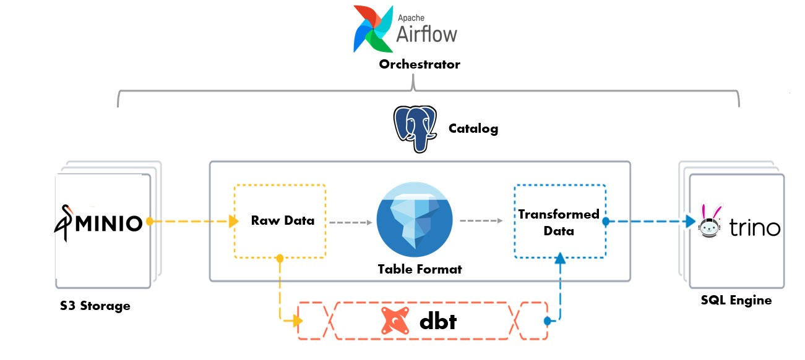

# Trino with Iceberg, Postgres, MinIO, and Airflow

### Airflow Port 8080
Username: airflow
Password: airflow
```bash
cd airflow-docker
curl -LfO 'https://airflow.apache.org/docs/apache-airflow/3.1.0/docker-compose.yaml'
docker compose up airflow-init -d
docker compose up -d
docker ps
>>
Multiple apache/airflow:3.1.0 containers
```

### Trino 477 Port 8081 & MinIO Port 9000
Trino
Username: type any letter and click login.

MinIO
Username: minioadmin
Password: minioadmin
```bash
cd trino
docker compose up -d
docker ps

# connection strings that works in Superset when iceberg.jdbc-catalog.catalog-schema=iceberg is commented out?
# trino://trino@host.docker.internal:8081
# trino://trino@trino-trino-1:8081/iceberg
# trino://trino@trino-trino-1:8081/jdbc

# outline
# trino://{username}:{password}@{hostname}:{port}/{catalog}
```

### Superset Port 8088
Username: admin
Password: admin

```bash
cd superset
git clone https://github.com/apache/superset.git
echo "sqlalchemy-trino" >> ./docker/requirements-local.txt
docker compose -f docker-compose-non-dev.yml up -d
```
Inside of Trino
Click the +Database button.
Set Name to “Trino” and URI to `trino://trino@host.docker.internal:8081` and click Add.
- make sure you select in advanced the non-checked boxes of CREATE TABLE AS, CREATE VIEW AS, ALLOW DDL and DML


### Rust Ingest Run
```bash
cd rust-ingest
cargo build --release
cd pcap_sample unzstd ny4-opra-new-a-20230822T143000.pcap
cd ..
target/release/opra-pcap-replayer --pcap ./pcap_samples/ny4-opra-new-a-20230822T143000.pcap  --bucket s3://market/bronze/opra_pcap/  --minio-endpoint http://127.0.0.1:9000  --access-key minioadmin --secret-key minioadmin  --parallel 4 --row-group-bytes 134217728
>>
2025-10-02T00:28:42.973075Z  INFO opra_pcap_replayer: decoded 0 packets, 0 messages (skeleton)
2025-10-02T00:28:42.979472Z  INFO opra_pcap_replayer: wrote "./demo_bronze.parquet"
2025-10-02T00:28:43.179312Z  INFO opra_pcap_replayer: uploaded to s3://market/bronze/opra_pcap/demo_bronze.parquet
```

### Wireshark
```bash
brew install wireshark   # gives tshark & capinfos
capinfos ny4-opra-new-a-20230822T143000.pcap
tshark -r ny4-opra-new-a-20230822T143000.pcap -c 20
```

### Global Docker Compose Network
Either 
* make a shared external network
```bash
docker network create lakehouse

# add inside each docker-compose.yaml
networks:
  default:
    external: true
    name: lakehouse
```


docker exec -it airflow-docker-postgres-1 psql -U airflow -d airflow -c "CREATE DATABASE iceberg;"
docker exec -it airflow-docker-postgres-1 psql -U airflow -d airflow -c "CREATE USER etl WITH PASSWORD 'demopass';"
docker exec -it airflow-docker-postgres-1 psql -U airflow -d airflow -c "GRANT ALL PRIVILEGES ON DATABASE iceberg TO etl;"


### Useful docker commands while debugging
```bash

# check which containers are on network
docker network inspect lakehouse --format '{{json .Containers}}' | jq .

# check which containers running
docker ps

# check if s3 file system works and and create table
docker exec -it trino-trino-1 trino --server http://localhost:8081 --execute "CREATE TABLE iceberg.bronze.demo_bronze (symbol VARCHAR, msg_count INTEGER) WITH (format='PARQUET', location='s3://warehouse/bronze/demo_bronze/');"
```

### Errors, Github tickets, and Debugging
* Hive: UnsupoortedFileSystem s3: 
  * Similar Github issue: https://github.com/trinodb/trino/discussions/21372 - Kevin added comment there.
  * Japanese site: https://blog.bedrock.day/09e466d8ce0ff1fa81ef
* Superset Database Connection: Had to use these directions: https://trino.io/episodes/12.html under `Demo: Superset querying Trino to create visualization dashboard` to get the database set up.
* Airflow in Docker: https://airflow.apache.org/docs/apache-airflow/stable/howto/docker-compose/index.html

* JDBC: Cannot check and eventually update SQL schema
  * docker exec -it trino-trino-1 trino --server http://localhost:8081 --execute "SHOW SCHEMAS FROM iceberg;"
Query 20251006_181302_00001_sqjj3 failed: Cannot check and eventually update SQL schema
  * 'iceberg.jdbc-catalog.initialize-catalog-tables' was not used in Trino 464: https://github.com/trinodb/trino/issues/17744
  * Solution
```bash
docker exec -i trino-iceberg-db-1 psql -U iceberg -d iceberg -c "CREATE TABLE IF NOT EXISTS iceberg_tables (catalog_name VARCHAR(255) NOT NULL, table_namespace VARCHAR(255) NOT NULL, table_name VARCHAR(255) NOT NULL, metadata_location VARCHAR(1000), previous_metadata_location VARCHAR(1000), iceberg_type VARCHAR(5), PRIMARY KEY (catalog_name, table_namespace, table_name));"

docker exec -i trino-iceberg-db-1 psql -U iceberg -d iceberg -c "CREATE TABLE IF NOT EXISTS iceberg_namespace_properties (catalog_name VARCHAR(255) NOT NULL, namespace VARCHAR(255) NOT NULL, property_key VARCHAR(255), property_value VARCHAR(1000), PRIMARY KEY (catalog_name, namespace, property_key));"

docker exec -i trino-iceberg-db-1 psql -U iceberg -d iceberg -c "CREATE TABLE IF NOT EXISTS iceberg_views (catalog_name VARCHAR(255) NOT NULL, table_namespace VARCHAR(255) NOT NULL, table_name VARCHAR(255) NOT NULL, metadata_location VARCHAR(1000), previous_metadata_location VARCHAR(1000), PRIMARY KEY (catalog_name, table_namespace, table_name));"

docker exec -i trino-iceberg-db-1 psql -U iceberg -d iceberg -c "\dt"

docker exec -i trino-trino-1 trino --server http://localhost:8081 --execute "SHOW CATALOGS"

docker exec -i trino-trino-1 trino --server http://localhost:8081 --execute "SHOW SCHEMAS FROM iceberg"
>> Shows Schemas - information_schema, system, bronze (if created)
```
