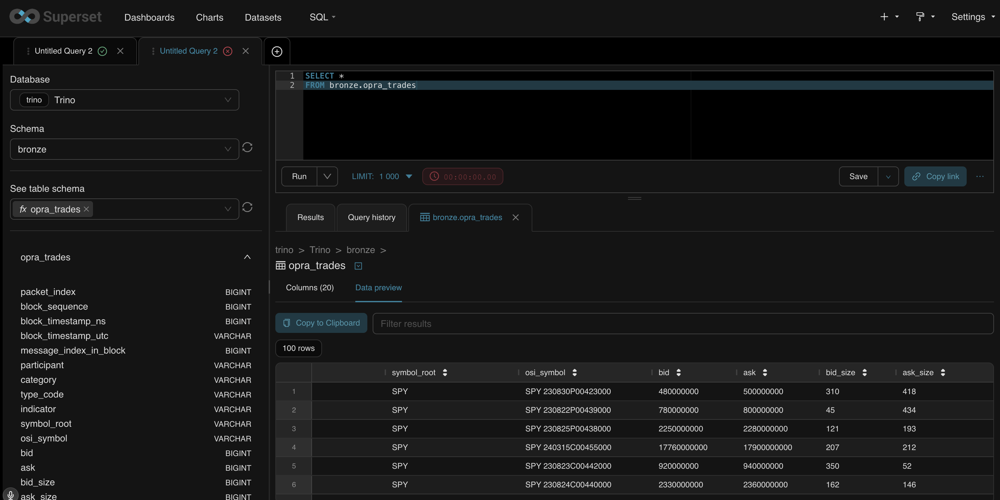
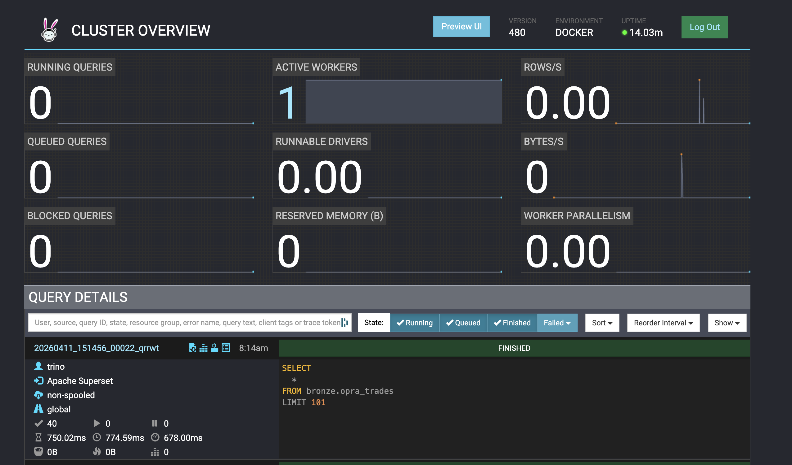
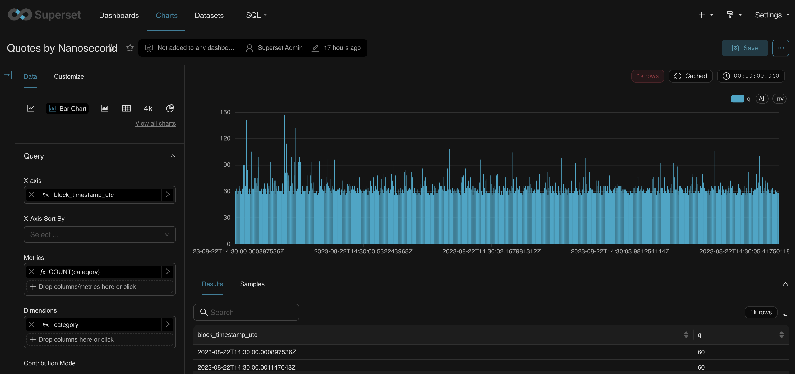
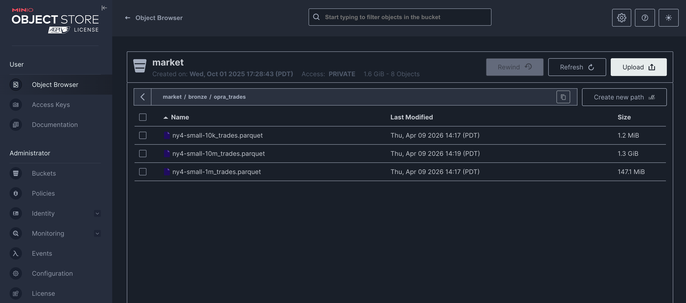
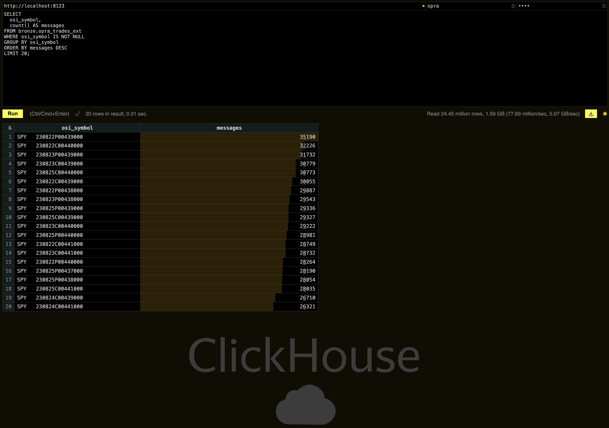

# 🦀 Rust OPRA PCAP Ingestion & Decoding Pipeline
### 🧊 Trino + Iceberg + Postgres + MinIO + Airflow + Superset + ClickHouse

Rust-based OPRA PCAP ingestion.
A full local **lakehouse stack** for data ingestion, query federation, and orchestration integrating Trino, Apache Iceberg, MinIO (S3-compatible object store), Postgres (metadata + Airflow DB), and Apache Airflow.

---
### Why?
Fundamentally, as with any README, it should answer why. While items like design decision, architecture, and implementation details are listed below, the core motivation was simple; to learn how option trades which are extremely popular financial instruments actually get from a consolidated feed (OPRA) to the end user. I.E. How the raw bytes on the wire get transformed into something queryable and usable for research and analysis in a High-Frequency Trading context. If you've been around financial data for any period of time you've likely seen normalized files which are scrubbed for you prior to delivery or ingestion. Often the rules are opaque and you can't understand the decisions that went into the schema and table formats. This project was a way to build from the rawest data possible, packet capture files (PCAP) directly from OPRA. A mini version of that pipeline is here in Rust, with the goal of understanding the key components, tradeoffs, and design decisions involved in building a production-grade market data ingestion system.

---
### Visually Appealing End Results
I put this section at the front because it's the most fun part to see the end results of the pipeline in action, and it also helps motivate the design and implementation details that come later. The screenshots below show the full end-to-end flow from raw OPRA PCAP ingestion by our Rust binary, to parquet storage in MinIO, to querying and visualization in Superset via Trino.
- Ingested OPRA quotes and trades from PCAPs are available in Superset for ad-hoc querying and dashboarding, all powered by Trino querying MinIO parquet directly.

- Trino UI showing successful runs from Superset SQL Lab querying the MinIO parquet files created by our Rust binary.

- Superset Charts & Dashboards querying Trino over MinIO parquet. Quotes by Nanosecond from OPRA feed, all decoded and ingested by our Rust binary.

- MinIO Console showing ingested parquet files from our Rust binary, which are then queried directly by Trino without needing to load into a traditional database.

- Clickhouse showing extremely fast queries on the trades schema


---
### Design Philosophy
* Keep ingestion simple and fast for local research: load PCAPs in memory, decode in parallel, and write local parquet artifacts.
* Use MinIO as a local S3-compatible store to mirror a production-like architecture and enable easy transition to any cloud storage in the future (AWS, GCP, Azure, etc.).
* Use Trino with Hive connector to query MinIO parquet directly, and optionally create Iceberg views for more advanced features, while keeping the initial focus on a straightforward external table over parquet.
* Use Superset for quick visualization and ad-hoc querying of the ingested data, while also providing a user- friendly interface for managing Trino connections and exploring the data without needing to use the command line or write SQL directly in Trino CLI.
* Use Airflow for orchestration to mirror a production workflow, even though the current pipeline is simple and could be run with a single script. This allows us to easily add complexity in the future (e.g. multiple steps, dependencies, scheduling) without refactoring the entire codebase.

---

### Tokio runtime decision
* File reads are done with async I/O (`read_pcap_file` + `tokio::try_join!`) so the 3 PCAPs can be loaded concurrently without blocking the runtime thread, while CPU-heavy decode paths are moved into `tokio::task::spawn_blocking(...)` so parse work runs on the blocking pool and does not starve async tasks.
* For now this is sufficient since `try_join!` interleaves the 3 PCAP file reads on the Root Task and we statically know the amount of PCAPs being processed; however, if the number of PCAPs to process were dynamic or very large, this approach would not scale as well since try_join! requires knowing all futures up front. In this case using `tokio::spawn` to spawn a new task for each file individually and then collecting them into a join_all could be a more scalable approach. Additionally, a semaphore could be used to limit concurrency so that only a bounded number of PCAPs are being read into memory at once rather than spawning unbounded tasks that could overwhelm memory.
* Furthermore, if we move to a primary low-latency ingestion mode we would need to focus on streaming PCAP files which would likely have us use tokio streams to read packets as they arrive rather than loading entire PCAPs into memory before decoding.

---
### Lessons Learned
* Batch decode is practical and fast for these sample sizes.
* Rayon helps more as packet volume grows; tiny files can still pay parallel overhead. About 30ms speed up over single-threaded decode for the 10m sample.
* End-to-end throughput is good in-memory, but a future streaming mode would reduce startup latency and memory pressure on very large captures.


---
### Bring Up Containers before running Rust Ingest Binary

```bash
# 1) Airflow (creates/uses lakehouse network)
cd airflow-docker
docker compose up airflow-init -d
docker compose up -d

# 2) Trino + MinIO + Hive Metastore stack
cd ../trino
docker compose up -d

# 3) Superset
cd ../superset
docker compose -f docker-compose-non-dev.yml up -d

# 4) Verify
docker ps
```

Default local ports:
- Airflow: `8080`
- MinIO API: `9000`, MinIO Console: `9001`
- Trino: `8081`
- Superset: `8088`
- ClickHouse HTTP/UI: `8123`, native TCP: `9002`

---

### Optional: Query OPRA Trades in ClickHouse (Local UI)

If you want a very fast local SQL UI in addition to Trino + Superset, you can run ClickHouse in the same `lakehouse` Docker network and point it directly at the parquet files already written to MinIO under `s3://market/bronze/opra_trades/`.

```bash
# from repo root
cd trino
docker compose up -d clickhouse

# open ClickHouse web UI (embedded in recent versions)
# http://localhost:8123
#
# login:
# user: opra
# password: opra
# database: bronze
```

In the ClickHouse SQL editor, create a view over MinIO parquet:

```sql
CREATE OR REPLACE VIEW bronze.opra_trades_ext AS
SELECT *
FROM s3(
  'http://minio:9000/market/bronze/opra_trades/*.parquet',
  'minioadmin',
  'minioadmin',
  'Parquet'
);
```

Example queries:

```sql
SELECT count() AS trade_rows
FROM bronze.opra_trades_ext;

SELECT
  osi_symbol,
  count() AS messages
FROM bronze.opra_trades_ext
WHERE osi_symbol IS NOT NULL
GROUP BY osi_symbol
ORDER BY messages DESC
LIMIT 20;
```

---

### Run the Rust Ingest Binary

```bash
# run ingest on all 3 sample pcaps (10k, 1m, 10m)
# writes local parquet + auto-uploads each output to MinIO
cd rust-ingest
cargo run --release
>>
  # Output 2 schemas per PCAP (header + trades):
  1. wrote header parquet to "./pcap_samples/ny4-small-10k_header.parquet" with 10000 rows
  2. wrote "./pcap_samples/ny4-small-10k_trades.parquet" with 14440 decoded trade rows

  header schema (`*_header.parquet`):
  - packet_index: UInt64 NOT NULL
  - udp_payload_len: UInt64 NOT NULL
  - block_size: UInt64 NOT NULL
  - messages_in_block: UInt64 NOT NULL

  trades schema (`*_trades.parquet`):
  - packet_index: UInt64 NOT NULL
  - block_sequence: UInt64 NOT NULL
  - block_timestamp_ns: UInt64 NOT NULL
  - block_timestamp_utc: Utf8 NOT NULL
  - message_index_in_block: UInt64 NOT NULL
  - participant: Utf8 NOT NULL
  - category: Utf8 NOT NULL
  - type_code: Utf8 NOT NULL
  - indicator: Utf8 NOT NULL
  - symbol_root: Utf8 NULL
  - osi_symbol: Utf8 NULL
  - bid: Int64 NULL   # fixed-point nanodollars
  - ask: Int64 NULL   # fixed-point nanodollars
  - bid_size: UInt64 NULL
  - ask_size: UInt64 NULL
  - price: Int64 NULL # fixed-point nanodollars
  - size: UInt64 NULL
  - side: Utf8 NULL
  - action: Utf8 NULL
  - flags: UInt64 NULL

# optional MinIO env overrides (defaults shown)
OPRA_MINIO_ENDPOINT=http://localhost:9000
OPRA_MINIO_ACCESS_KEY=minioadmin
OPRA_MINIO_SECRET_KEY=minioadmin
OPRA_MINIO_BUCKET=market
OPRA_MINIO_PREFIX=bronze

# optional Trino auto-create env overrides (defaults shown)
OPRA_AUTO_CREATE_TRINO_SCHEMA=true
OPRA_TRINO_ENDPOINT=http://localhost:8081
OPRA_TRINO_USER=trino
OPRA_TRINO_CATALOG=hive
OPRA_TRINO_SCHEMA=bronze
OPRA_TRINO_TRADES_TABLE=opra_trades_ext
OPRA_TRINO_HIVE_CATALOG=hive
OPRA_TRINO_HIVE_TRADES_TABLE=opra_trades_ext
# optional explicit table location (otherwise derived from bucket/prefix)
# OPRA_TRINO_TRADES_LOCATION=s3://market/bronze/opra_trades/

# example: expose data in iceberg via view while still reading parquet from hive external table
# OPRA_TRINO_CATALOG=iceberg
# OPRA_TRINO_SCHEMA=bronze
# OPRA_TRINO_TRADES_TABLE=opra_trades

# optional: point to a different samples directory
cargo run --release -- --pcap-dir ./pcap_samples

# optional: pin rayon worker count
cargo run --release -- --parallel 8
```

---

### Optional: cuTile Rust Smoke Test (`src/bin`)

This repo now includes a minimal `cutile-rs` starter binary at `rust-ingest/src/bin/cutile_smoke.rs`.

```bash
cd rust-ingest

# shows feature/toolchain instructions only (no GPU required)
cargo run --bin cutile_smoke

# actually JIT-compiles and launches a tiny add kernel (requires Linux + CUDA + supported NVIDIA GPU)
cargo run --bin cutile_smoke --features gpu-cutile
```

Notes:
- `gpu-cutile` adds an optional git dependency on NVLabs `cutile-rs` (`cutile` crate).
- First run will take longer because the kernel is compiled/JIT-cached.

### cuTile Benchmark Snapshot (Quote Path)

For first-time readers, this benchmark uses OPRA quote rows from:
- `rust-ingest/pcap_samples/ny4-small-10m_trades.parquet`

We run a cuTile kernel and compare CPU math vs GPU kernel math on the same rows.

```bash
./infra/aws-gpu/run-cutile-quote-spread.sh

quote rows used: 20829552
partition size: 16
work iters per row: 16
mean abs diff cpu vs gpu score: 0.000000000000
read parquet ms: 3798.059
cpu score compute ms: 210.834
gpu h2d ms: 474.695
gpu kernel ms: 156.418
gpu d2h ms: 53.116
gpu pipeline total ms: 684.230
cpu groupby ms: 1532.265
speedup (cpu_score_compute / gpu_kernel): 1.35x
speedup (cpu_score_compute / gpu_pipeline_total): 0.31x
```

What this is doing:
- `cpu score compute ms` and `gpu kernel ms` are the apples-to-apples compute-only comparison.
- `1.35x` here means GPU kernel math is faster than CPU math for this compute-heavy row function.
- `gpu pipeline total ms` is larger because it includes transfer overhead (`h2d` and `d2h`).
- `cpu groupby ms` is a separate CPU aggregation stage and is not part of kernel timing.

What "harder math per row" means:
- The original spread formula is light math per row and tends to be transfer/memory bound.
- To test GPU compute behavior, we use a repeated per-row recurrence (`work iters per row`).
- This is a synthetic benchmark score, but it demonstrates when GPU kernel throughput starts to outperform CPU compute.

---

### One-command AWS GPU Spin-Up for cuTile

If you are on Apple Silicon (e.g. M2 Max), you can still run `cutile-rs` by provisioning a temporary NVIDIA EC2 instance from your laptop and tearing it down immediately after the test.

This repo uses Terraform under `infra/aws-gpu` and includes helper scripts to:
- create a GPU EC2 host
- sync this repo and run `cargo run --bin cutile_smoke --features gpu-cutile`
- terminate the instance to stop compute charges

Prereqs on your Mac:
- Terraform
- AWS CLI v2 configured (`aws configure`)
- `rsync`, `ssh`, `curl`

Setup:

```bash
cp infra/aws-gpu/terraform.tfvars.example infra/aws-gpu/terraform.tfvars
# edit terraform.tfvars as desired:
# - aws_region
# - instance_type
# - optional ssh_user / ssh_cidr / ami_id / vpc_id / subnet_id (aws_profile defaults to "yourawsprofile")
```

Run end-to-end:

```bash
# 1) Terraform init + apply (also auto-generates an EC2 key pair from scratch)
./infra/aws-gpu/up.sh

# 2) Install toolchain remotely, sync repo, run cutile smoke binary
./infra/aws-gpu/run-cutile-smoke.sh

# 3) OPTIONAL: SSH in manually
./infra/aws-gpu/ssh.sh

# 4) IMPORTANT: terminate instance when finished to avoid ongoing charges
./infra/aws-gpu/down.sh
```

Cost safety notes:
- `down.sh` runs `terraform destroy` and removes all managed AWS resources.
- The instance is configured with `instance-initiated-shutdown-behavior=terminate`, so running `sudo shutdown -h now` on the host also terminates it.
- You still pay for any runtime between `up.sh` and `down.sh`.

---

## Project structure
```bash
tree -L 4 -I 'node_modules|__pycache__|logs|plugins|superset|debug|release' -P '*.yaml|*.properties|*.yml|*.rs|*.xml|*.pcap'
>>
├── airflow-docker
│   ├── config
│   ├── dags
│   └── docker-compose.yaml         # sets up airflow
├── superset
│   └── docker-compose-non-dev.yaml # sets up superset
├── research
│   └── environment.yml
├── rust-ingest                     # actual PCAP ingestion & parsing
│   ├── pcap_samples
│   │   └── ny4-opra-new-a-20230822T143000.pcap
│   ├── src
│   │   ├── arrow_sink.rs
│   │   ├── main.rs
│   │   ├── opra_decoder.rs
│   │   └── telemetry.rs
│   └── target
└── trino
    ├── docker-compose.yaml         # sets up trino, minio, hive-metastore, hive-postgres db
    ├── etc
    │   ├── catalog
    │   │   ├── hive.properties
    │   │   └── iceberg.properties
    │   └── config.properties
    ├── hadoop
    │   └── conf
    │       └── core-site.xml
    ├── hive
    │   ├── conf
    │   │   └── hive-site.xml
    │   └── lib
    └── jars
```

---

## 🧠 Wireshark / tshark Utilities

```bash
brew install wireshark   # provides tshark & capinfos
cd rust-ingest/pcap_samples
tshark -r ny4-opra-new-a-20230822T143000.pcap -c 5
>>
    1   0.000000 162.69.45.40 → 224.0.204.40 UDP 154 45040 → 45040 Len=108
    2   0.000003 162.69.45.37 → 224.0.204.37 UDP 96 45037 → 45037 Len=50
    3   0.000004 162.69.45.38 → 224.0.204.38 UDP 212 45038 → 45038 Len=166
    4   0.000008 162.69.45.38 → 224.0.204.38 UDP 96 45038 → 45038 Len=50
    5   0.000009 162.69.45.37 → 224.0.204.37 UDP 154 45037 → 45037 Len=108

# check how many packets there are in total
capinfos -c ./pcap_samples/ny4-opra-new-a-20230822T143000.pcap
File name:           ./pcap_samples/ny4-opra-new-a-20230822T143000.pcap
Number of packets:   79 M

# export 1 packet to a json for easier inspection
tshark -r ny4-opra-new-a-20230822T143000.pcap -c 1 -T json > example_packets.json
```

| **Column** | **Example** | **Description** |
|-------------|--------------|-----------------|
| **No.** | `1` | Sequential frame number in the capture file. |
| **Time** | `0.000000` | Seconds since start of capture — useful for latency analysis. |
| **Source** | `162.69.45.40` | Source IP address (unicast sender of the OPRA feed). |
| **→** | `→` | Direction of the packet flow. |
| **Destination** | `224.0.204.40` | Multicast group address — identifies the OPRA channel. |
| **Protocol** | `UDP` | Transport protocol (OPRA uses UDP multicast). |
| **Length** | `154` | Total frame size (bytes on wire, ETH header, IPv4, UDP, including headers). |
| **Info** | `45040 → 45040 Len=108` | UDP layer summary: source port, destination port, and payload size. |

---

## PCAP Structure Overview
```bash
# High level structure + OPRA-focused depth
PCAP Packet Record                                          # tshark summary example: UDP 154 ... Len=108
└── Ethernet Frame                                          # 154 total bytes
      ├── Ethernet Header (eth.*)                             # 14 bytes
      ├── VLAN Header (vlan.*)                                # 4 bytes (when present)
      └── IPv4 Packet (ip.*)                                # 136 bytes after Ethernet
            ├── IPv4 Header                                   # 20 bytes (no options)
            └── UDP Datagram (udp.*)                        # 116 bytes after IPv4
                  ├── UDP Header                              # 8 bytes
                  └── UDP Payload (udp.payload / data.data) # 108 bytes = tshark `Len=108`
                        └── OPRA Transmission Block         # begins at first UDP payload byte
                              ├── OPRA Block Header         # first 21 bytes
                              │     ├── Block Size
                              │     ├── Data Feed Indicator ('O')
                              │     ├── Retransmission Indicator
                              │     ├── Session Indicator
                              │     ├── Block Sequence Number
                              │     ├── Messages In Block
                              │     ├── Timestamp (sec + ns)
                              │     └── Checksum
                              └── OPRA Messages             # remaining bytes in payload = 108 - 21 = 87 bytes
                                    ├── Message #1
                                    │     ├── 12-byte Message Header
                                    │     └── Message Body
                                    ├── Message #2
                                    │     ├── 12-byte Message Header
                                    │     └── Message Body
                                    └── ...
```

---

### OPRA Spec Primer

This parser is based on OPRA Pillar binary transmission structure:

- Transmission Block:
  - Block Header: `21` bytes
  - Block Data: one or more OPRA messages
  - Optional pad byte (`0x00`) when needed for even block length
- Message:
  - Message Header: `12` bytes
  - Message Body: format depends on `category + type + indicator`

Current OPRA references:

- OPRA Pillar Output Specification (Feb 20, 2026): <https://cdn.opraplan.com/documents/OPRA_Pillar_Output_Specification.pdf>
- OPRA Pillar Input Specification (Feb 20, 2026): <https://cdn.opraplan.com/documents/OPRA_Pillar_Input_Specification.pdf>

#### Block Header Layout (21 bytes)

| **Offset** | **Length** | **Field** |
|------------|------------|-----------|
| `0` | `1` | Version |
| `1..3` | `2` | Block Size (big-endian) |
| `3` | `1` | Data Feed Indicator (`'O'`) |
| `4` | `1` | Retransmission Indicator |
| `5` | `1` | Session Indicator |
| `6..10` | `4` | Block Sequence Number |
| `10` | `1` | Messages In Block |
| `11..19` | `8` | Block Timestamp (`sec` + `nsec`) |
| `19..21` | `2` | Block Checksum |

#### Message Header Layout (12 bytes)

| **Offset** | **Length** | **Field** |
|------------|------------|-----------|
| `0` | `1` | Participant ID |
| `1` | `1` | Message Category |
| `2` | `1` | Message Type |
| `3` | `1` | Message Indicator |
| `4..8` | `4` | Transaction ID |
| `8..12` | `4` | Participant Reference Number |

#### OPRA PCAP Decoding Example

Reminder of mental model from above:

```text
└── OPRA Transmission Block         # begins at first UDP payload byte
      ├── OPRA Block Header         # first 21 bytes
      │     ├── Block Size
      │     ├── Data Feed Indicator ('O')
      │     ├── Retransmission Indicator
      │     ├── Session Indicator
      │     ├── Block Sequence Number
      │     ├── Messages In Block
      │     ├── Timestamp (sec + ns)
      │     └── Checksum
      └── OPRA Messages             # remaining bytes in payload
            ├── Message #1
                  ├── 12-byte Message Header
                  └── "k" Message Body
```

Here is a synthetic but realistic raw byte example for a single OPRA block carrying one `k` quote message:

```text
00 2B 01 00 00 00 00 10 01 00 00 00 5F 37 59 DF 00 00 00 00 00 # 21 byte OPRA block header
43 6B 20 41 00 BC 61 4E 00 00 00 00                            # 12 byte OPRA message header
53 50 59 20 20 00 57 11 17 42 00 07 6A 50 42                   # OPRA `k` message body
00 00 00 9D 00 00 00 19 00 00 00 A0 00 00 00 12                # OPRA `k` message body continuation
```

The first 21 bytes are the OPRA block header:

```text
00 2B                    -> block size
01                       -> feed indicator
00                       -> retransmission indicator
00                       -> session indicator
00 00 00 10              -> block sequence number
01                       -> message count
00 00 00 5F 37 59 DF     -> block timestamp
00 00 00 00              -> checksum
00                       -> reserved
```

That decodes conceptually to something like:

```json
{
  "block_size": 43,
  "block_sequence": 16,
  "message_count": 1,
  "timestamp_raw": 1597463007
}
```

Immediately after the block header comes the 12-byte OPRA message header:

```text
43                       -> participant id = 'C'
6B                       -> message category = 'k'
20                       -> message type = ' '
41                       -> message indicator = 'A'
00 BC 61 4E              -> transaction id = 12345678
00 00 00 00              -> participant reference number = 0
```

That decodes to:

```json
{
  "participant_id": "C",
  "message_category": "k",
  "message_type": " ",
  "message_indicator": "A",
  "transaction_id": 12345678,
  "participant_reference_number": 0
}
```

The remaining bytes are the `k` message body:

```text
53 50 59 20 20           -> security symbol = "SPY  "
00                       -> reserved
57                       -> expiration month code = 'W'
11                       -> expiration day = 17
17                       -> expiration year offset = 23
42                       -> strike denominator code = 'B'
00 07 6A 50              -> strike price raw = 486000
42                       -> premium price denominator code = 'B'
00 00 00 9D              -> bid price raw = 157
00 00 00 19              -> bid size raw = 25
00 00 00 A0              -> ask price raw = 160
00 00 00 12              -> ask size raw = 18
```

Now decode the business meaning of those fields. The symbol is `SPY`. The month code `W` means a November put. The day is `17`. The year byte is stored as an offset from 2000, so `23` means `2023`. The strike denominator code `B` means divide the raw strike integer by 100, so `486000` becomes `4860.00`. The premium denominator code `B` also means divide by 100, so the bid raw value `157` becomes `1.57` and the ask raw value `160` becomes `1.60`. The sizes remain integer contract sizes.

Internally, the decoder now stores quote/trade prices as fixed-point nanodollars (`i64`) for parity and deterministic math:

- `157` with denominator `B` (`2` decimal places) -> `1.57` dollars
- `1.57 * 1_000_000_000` -> `1_570_000_000` nanodollars
- `160` with denominator `B` -> `1_600_000_000` nanodollars

So the fully decoded quote becomes:

```json
{
  "participant_id": "C",
  "message_category": "k",
  "message_type": " ",
  "message_indicator": "A",
  "transaction_id": 12345678,
  "participant_reference_number": 0,
  "security_symbol": "SPY",
  "expiration_date": "2023-11-17",
  "option_side": "put",
  "strike_price": 4860.00,
  "bid_price": 1.57,
  "bid_size": 25,
  "ask_price": 1.60,
  "ask_size": 18
}
```

A Rust-oriented mental model for this same message is:

```rust
struct OpraBlockHeader {
    block_size: u16,
    feed_indicator: u8,
    retransmission_indicator: u8,
    session_indicator: u8,
    block_sequence_number: u32,
    message_count: u8,
    block_timestamp: u64,
    checksum: u32,
    reserved: u8,
}

struct OpraMessageHeader {
    participant_id: u8,
    message_category: u8,
    message_type: u8,
    message_indicator: u8,
    transaction_id: u32,
    participant_reference_number: u32,
}

struct KQuoteBody {
    security_symbol: [u8; 5],
    reserved: u8,
    expiration_month_code: u8,
    expiration_day: u8,
    expiration_year_offset: u8,
    strike_price_denominator_code: u8,
    strike_price_raw: u32,
    premium_price_denominator_code: u8,
    bid_price_raw: u32,
    bid_size_raw: u32,
    ask_price_raw: u32,
    ask_size_raw: u32,
}
```

A simple parsing flow in Rust looks like this:

1. Receive a UDP payload containing an OPRA block.
2. Parse the OPRA block header from the start of the payload.
3. Iterate over the number of messages indicated in the block header:
   1. Parse the 12-byte message header.
   2. Dispatch to the appropriate message body parser based on `category + type + indicator`.
   3. Decode the message body into a structured Rust type (`KQuoteBody`, `QQuoteBody`, etc.).

The key takeaway is that the block header is the outer container for a batch of messages, the message header determines how to interpret each individual message, and the actual market data lives in the message body.

#### Fixed-Point Nanodollar Conversion (End-to-End)

For parity with Databento DBN records, OPRA decoded `bid`, `ask`, and trade `price` are stored as `i64` nanodollars (1e-9 dollars), not `f64`.

Conversion path used by the decoder:

1. Read raw integer bytes from message body (`u16` or `u32`).
2. Read denominator code (`A/B/C/D` -> 1/2/3/4 decimal places).
3. Convert to nanodollars using:
   - `scale_pow = 9 - decimal_places`
   - `nanos = raw * 10^scale_pow`

Concrete byte example from OPRA body:

```text
00 00 00 9D  -> bid raw = 157
42           -> denominator code = 'B' (2 decimal places)
```

```text
decimal price = 157 / 10^2 = 1.57
nanodollars  = 157 * 10^(9-2) = 157 * 10^7 = 1_570_000_000
```

Another one:

```text
00 00 00 A0  -> ask raw = 160
42           -> 'B' -> 2 decimal places
ask nanos    = 160 * 10^7 = 1_600_000_000
```

This gives exact integer parity against Databento `TradeMsg.price` (also fixed-point), instead of tolerance-based float comparisons.

#### What Our Code Does Today

1. Strip Ethernet/VLAN/IPv4/UDP and isolate UDP payload.
2. Parse OPRA block header.
3. Walk each OPRA block message-by-message with a cursor.
4. Parse each 12-byte message header.
5. Decode implemented families (`q`, `k`, `a`) into `DecodedTradeRow` with fixed-point nanodollar price fields (`bid`, `ask`, `price`).

Current decoder architecture in code:

- Entry point: `decode_pcap_trades_schema` -> `decode_trade_rows_from_frame`
- Message keying: build `MessageDispatchKey { category, type_code, indicator }`
- Spec routing: `classify_message_family(...)` -> `decode_message_by_spec(...)`
- Family parser (implemented): `parse_short_quote_row` (`q`), `parse_long_quote_row` (`k`), `parse_equity_index_last_sale_row` (`a`)
- Row sink: `arrow_sink::write_trades_parquet(...)`

This gives us a production-style extension point: add a new family parser and wire it in
`decode_message_by_spec` without changing the rest of the pipeline.

#### What “Production” Still Requires

- Family parsers implemented for the remaining classified OPRA message families
- Exact appendage handling (none/single/double) where spec requires it
- Broader trade-print family parsing beyond initial `a` implementation to populate all true trade fields (`price/size/conditions/...`)
- Category-specific handling for variable-length administrative/control messages

---

## 🐳 Global Docker Network
Make all services share one network:
```bash

# This is already set inside of airflow-docker/docker-compose.yaml which will
# create the network automatically if it doesn't exist
networks:
  default:
    # external: true # Uncomment if you already created this network with docker network create lakehouse, if not, it will be created automatically when you run docker-compose up
    name: lakehouse

# Already inside of trino/docker-compose.yaml, superset/docker-compose-non-dev.yaml
networks:
  default:
    external: true # will connect to lakehouse network assuming you already stood up airflow-docker which creates it
    name: lakehouse
```

---

## 🪶 Apache Airflow
**Port:** `8080`  
**Username:** `airflow`  
**Password:** `airflow`

```bash
cd airflow-docker
curl -LfO 'https://airflow.apache.org/docs/apache-airflow/3.1.0/docker-compose.yaml'
docker compose up airflow-init -d
docker compose up -d
docker ps  # Should show multiple apache/airflow:3.1.0 containers
```

---

## ☁️ MinIO (S3-Compatible Storage)
**Port:** `9000` (API), `9001` (Console)  
**Credentials:**  
```
Username: minioadmin
Password: minioadmin
```

```bash
cd trino
docker compose up -d
docker ps
```

---

## ⚙️ Trino 477
**Port:** `8081`  
**Login:** Any username; no password required for default setup.

**Example Superset Connection Strings**
```bash
trino://trino@trino-trino-1:8081/iceberg
# Format:
# trino://{username}:{password}@{hostname}:{port}/{catalog}
```

---

## 📊 Apache Superset
**Port:** `8088`  
**Username:** `admin`  
**Password:** `admin`

```bash
cd superset
git clone https://github.com/apache/superset.git
# check if you already have sqlalchemy-trino in your local requirements
grep -n "sqlalchemy-trino" ./docker/requirements-local.txt

# if not then run this command to add it
# echo "sqlalchemy-trino" >> ./docker/requirements-local.txt

docker compose -f docker-compose-non-dev.yml up -d
```

**Add Trino Connection:**
1. In Superset, Settings -> Database Connections -> click **+ Database**.  
2. Set **Name:** `Trino`  
3. Set **URI:** `trino://trino@trino:8081/iceberg`
4. In **Advanced**, ensure the following boxes are unchecked:
   - `CREATE TABLE AS`
   - `CREATE VIEW AS`
   - `ALLOW DDL`
   - `ALLOW DML`

---

## 🦀 Rust Ingest Rayon vs Single-Threaded Performance

Findings: The single-threaded run is faster than Rayon for smaller PCAP workloads. For example on 10k packet PCAPs, single-threaded completes in ~119.75us while Rayon with 12 threads takes ~402.75us.
However, as the PCAP workload increased in file sizes closer to 10 million, Rayon performed that in 180 ms, whereas the single-threaded performed it in 211 ms.
It seems that Rayon is the winner as PCAP file sizes grow larger.

```bash
# get a workable sized PCAP to test on
tcpdump -r pcap_samples/ny4-opra-new-a-20230822T143000.pcap -c 1000000 -w pcap_samples/ny4-small-1m.pcap

# run the benchmark
cd rust-ingest

# run all 3 files; 10k, 1m, and 10m pcap samples
cargo bench --bench decode_pcap -- --noplot --sample-size 100

# single-file override
OPRA_BENCH_PCAP=pcap_samples/ny4-small-10k.pcap cargo bench --bench decode_pcap -- --noplot --sample-size 100 --measurement-time 2
```


## 🧑‍🔬 Creating Iceberg Schemas & Tables inside Superset
### Note: Trino can also be used directly for this, but doing it through Superset allows you to verify the connection and permissions from the UI.

```sql
-- Create bronze schema if it doesn't exist
CREATE SCHEMA IF NOT EXISTS iceberg.bronze;

-- Drop old table if you want a clean rebuild
DROP TABLE IF EXISTS iceberg.bronze.demo_bronze;

-- Create bronze table from the external hive staging table
CREATE TABLE iceberg.bronze.demo_bronze
WITH (
  format = 'PARQUET',
  location = 's3://warehouse/bronze/demo_bronze/'
) AS
SELECT *
FROM hive.stage.demo_bronze_ext;
```


---

## 🔧 Debugging & Maintenance

```bash
# View containers attached to network
docker network inspect lakehouse --format '{{json .Containers}}' | jq .

# List active containers
docker ps

# Test Trino Schemas present
docker exec -it trino-trino-1 trino   --server http://localhost:8081   --execute "SHOW SCHEMAS FROM iceberg;"

# Test Trino table creation
docker exec -it trino-trino-1 trino   --server http://localhost:8081   --execute "CREATE TABLE iceberg.bronze.demo_bronze (
      symbol VARCHAR,
      msg_count INTEGER
    )
    WITH (format='PARQUET', location='s3://warehouse/bronze/demo_bronze/');"
```

---

## 🚨 Common Errors & References

| **Issue** | **Description / Fix** |
|------------|-----------------------|
| `UnsupportedFileSystem s3:` | Related GitHub: [Trino discussion #21372](https://github.com/trinodb/trino/discussions/21372) — Kevin added comment there. Japanese blog: [Bedrock](https://blog.bedrock.day/09e466d8ce0ff1fa81ef) |
| **Superset DB Connection Failure** | Follow [Trino.io Episode #12](https://trino.io/episodes/12.html) under *Demo: Superset querying Trino*. |
| **Airflow in Docker** | Reference official [Airflow Compose guide](https://airflow.apache.org/docs/apache-airflow/stable/howto/docker-compose/index.html). |
